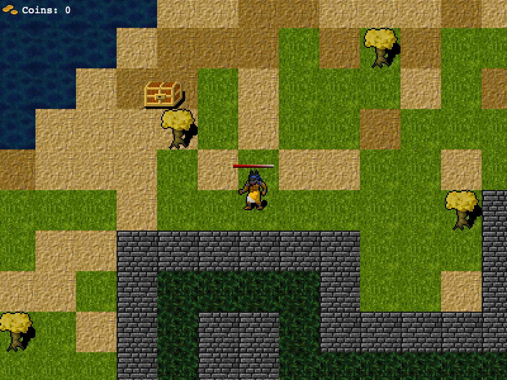

# Mystic Fate

<!-- ABOUT THE PROJECT -->
## About The Project

Mystic Fate is an RPG game built for educational purposes using the Phaser.js library. Players must collect the coins of fate while fighting different monsters in an enchanted land.

## Live Demo
[Mystic Fate](https://priceless-kalam-4cb4c2.netlify.app/)

## Getting Started

To get a local copy up and running follow these simple steps.

### Prerequisites

  You need to have git installed on your local system.
  You can clone this project with the command `$ git clone https://github.com/mariobarrioss/mystic-fate.git`.
  For this project you also require NPM installed on your machine.

### Install

  To install the dependencies for the application run the following commands in your terminal

  `$ npm install`

### Usage

  To build the appplication the following command needs to be run in the terminal

  `$ npm run build`

### Run tests

To run the tests type the following command in the terminal

`$ npm test`

### Deployment

To start the server and play locally type the following command in the terminal

`$ npm run start`

### Playing the game

To move around use the left, right, up and down keys. Press the spacebar when an enemy is nearby to perform an attack. The goal is to collect the greatest quantity of treasure chests that contain the coins of fate. If the player's health is depleted the score will be displayed and the player will appear in a random location in the map for another try.

## Author

👤 **Mario Barioss**

- GitHub: [@mariobarrioss](https://github.com/mariobarrioss)
- Twitter: [@mario_barrioss](https://twitter.com/@mario_barrioss)
- LinkedIn: [mariobarrioss](https://www.linkedin.com/in/mariobarrioss)

## 🤝 Contributing

Contributions, issues, and feature requests are welcome!

Feel free to check the [issues page](issues/).

## Show your support

Give a ⭐️ if you like this project!

## Acknowledgments

 * A huge thanks to the webpack team for making available modern tooling for javascript.
 * MDN

## 📝 License

This project is [MIT](https://github.com/mariobarrioss/mystic-fate/blob/game-setup/LICENSE) licensed.
